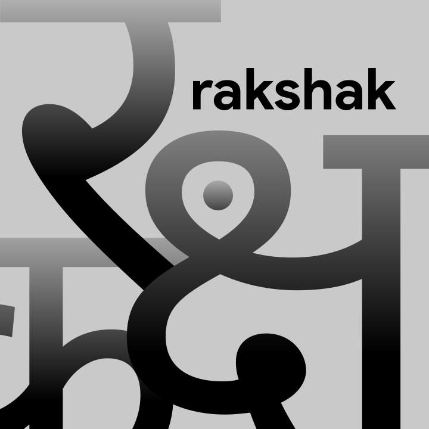

<p align="center">
  
</p>

> [!NOTE]
> This project was developed during a [hackathon↗](https://www.linkedin.com/posts/swatishchoudhury_we-won-the-grand-finale-of-technova-2024-activity-7250779607652573184-O7Bt).

# Rakshak - Backend

Rakshak is an emergency response system that connects users in need with nearby volunteer responders. This repository contains the backend API for the Rakshak.

## Features

- SOS Alert Handling
- Proximity-based Responder Selection
- Responder Notification and Acceptance
- Live Location Tracking

## Prerequisites

- Python 3.7+
- Firebase account and project setup

## Installation

1. Clone the repository:
   ```
   git clone https://github.com/swatishchoudhury/rakshak-backend.git
   cd rakshak-backend
   ```

2. Install the required dependencies:
   ```
   pip install -r requirements.txt
   ```

3. Set up your Firebase project and download the `serviceAccountKey.json` file.

4. Rename `.env.example` to `.env`, generate an API key, and set it there along with the path to `serviceAccountKey.json`


## Usage

1. Start the FastAPI server:
   ```
   uvicorn main:app --reload
   ```

2. The API will be available at `http://localhost:8000`

3. You can access the interactive API documentation at `http://localhost:8000/docs`

## API Endpoints

- `POST /smsapi/sos`: Receive and process SOS alerts
- `POST /responder/response`: Handle responder's response to SOS alerts
- `GET /sos/{sos_id}/status`: Retrieve the status of a specific SOS alert

## System Flow

The following diagram illustrates the flow of data and interactions between users, responders, and the backend services:


## Contributing

Contributions are welcome! Please feel free to submit a Pull Request.